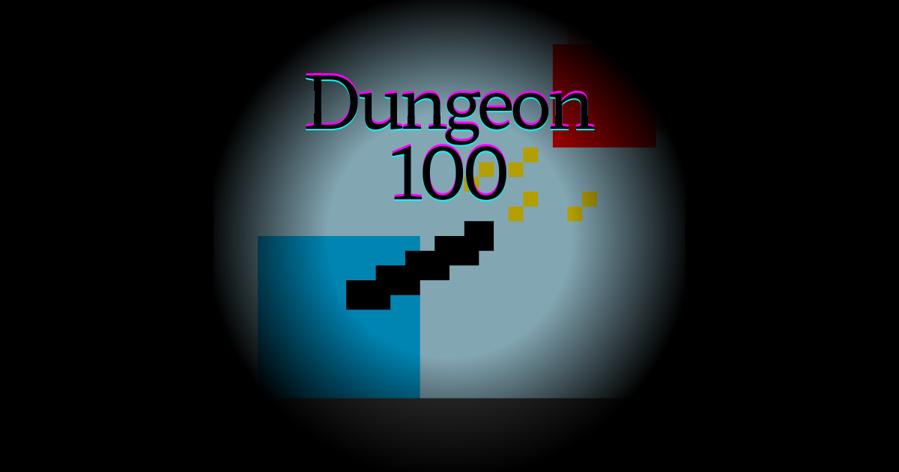

# 🔥 Dungeon 100 🔥

100층으로 이루어진 던전의 정상에 도전하는 2D 캔버스 슈팅 웹게임!
다양한 무기와 특수 능력으로 몰려오는 적들을 물리치세요.

 

  

 

## 📖 게임 소개

**Dungeon 100**은 HTML5 캔버스와 JavaScript로 만들어진 2D 슈팅 게임입니다.
1층부터 100층까지, 각 층의 적들을 모두 물리치고 다음 층으로 올라가는 것이 목표입니다. 
층이 높아질수록 적들은 더 강해집니다!

## ✨ 주요 기능

* **100층의 도전:** 100층의 정상을 목표로 끊임없이 도전하세요.
* **다양한 무기:** 권총, 샷건, 스나이퍼, 로켓 런처 등 개성 있는 무기들을 선택할 수 있습니다.
* **특수 능력:** 마우스 우클릭으로 무기별 고유 스킬(무적, 체력 회복, 연사 속도 증가 등)을 사용해 위기를 탈출하세요.
* **간단한 조작:** 키보드와 마우스만으로 모든 조작이 가능합니다.

## ⌨️ 조작 방법

| 키 | 액션 |
| --- | --- |
| **W, A, S, D** 또는 **방향키** | 플레이어 이동 |
| **마우스 이동** | 조준 |
| **마우스 좌클릭** | 발사 |
| **마우스 우클릭** | 특수 능력(스킬) 사용 |

## 💻 개발

* **제작자:** dank314
* **사용 기술:** HTML5 Canvas, JavaScript (ES6+)
* **호스팅:** GitHub Pages
